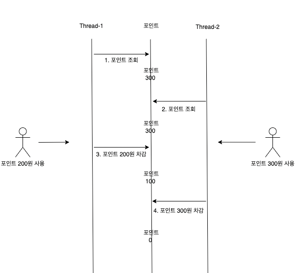

# 포인트 충전/사용 동시성 문제 해결

## 1. 문제 원인

포인트 변경(충전/사용) 시 멀티 스레드 환경에서 동시에 포인트 공유 자원에 접근하다 보니 데이터 정합성 문제가 발생하게 됩니다.

예를 들어 유저와 관리자 두 클라이언트가 같은 유저의 포인트의 값을 수정할 경우 실행 순서에 따라 결과 값이 달라질 수 있습니다.



## 2. synchronized

해당 문제를 해결하기 위해 synchronized를 사용하여 포인트를 수정하는 메서드는 오직 하나의 스레드만 실행할 수 있게 설정해 줍니다.

하지만 synchronized method에 진입하지 못한 나머지 스레드는 blocked 상태가 되며, 최악의 경우 deadlock 상태에 빠지게 됩니다.

```
public synchronized UserPoint use(PointRequest request) {
     // 포인트 사용 
}
```

## 3. ReentrantLock + ConcurrentHashMap

ReentrantLock을 사용하여 synchronized 문제점을 개선할 수 있습니다.

ReentrantLock은 deadlock을 피할 수 있으며, 공정 모드 옵션을 주게될 경우 요청 스레드 순서에 따라서 메서드를 실행 할 수 있습니다.

추가적으로 ConcurrentHashMap을 사용하여 유저별로 ReentrantLock을 생성한다면 불필요한 대기를 줄여 병목 현상을 개선할 수 있습니다.

```
private final Map<Long, ReentrantLock> locks = new ConcurrentHashMap<>();

public UserPoint use(PointRequest request) {

        ReentrantLock lock = locks.computeIfAbsent(request.getId(), k -> new ReentrantLock(false));
        // 락 획득 
        lock.lock();
        
        // 임계 영역 
        try {
            // 포인트 사용 
        } catch (RuntimeException e) {
            throw e;

        } finally {
            // 락 해제 
            lock.unlock();
        }
    }

```


